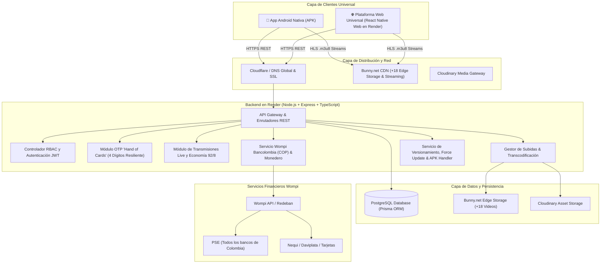
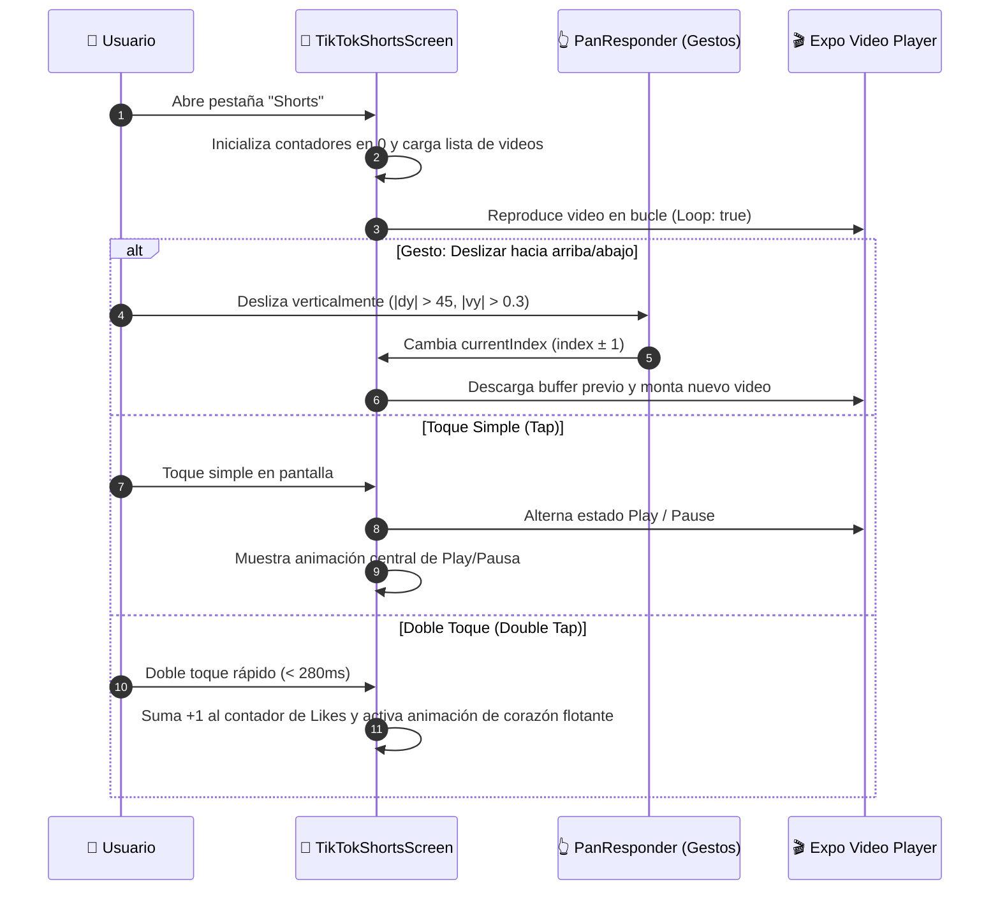
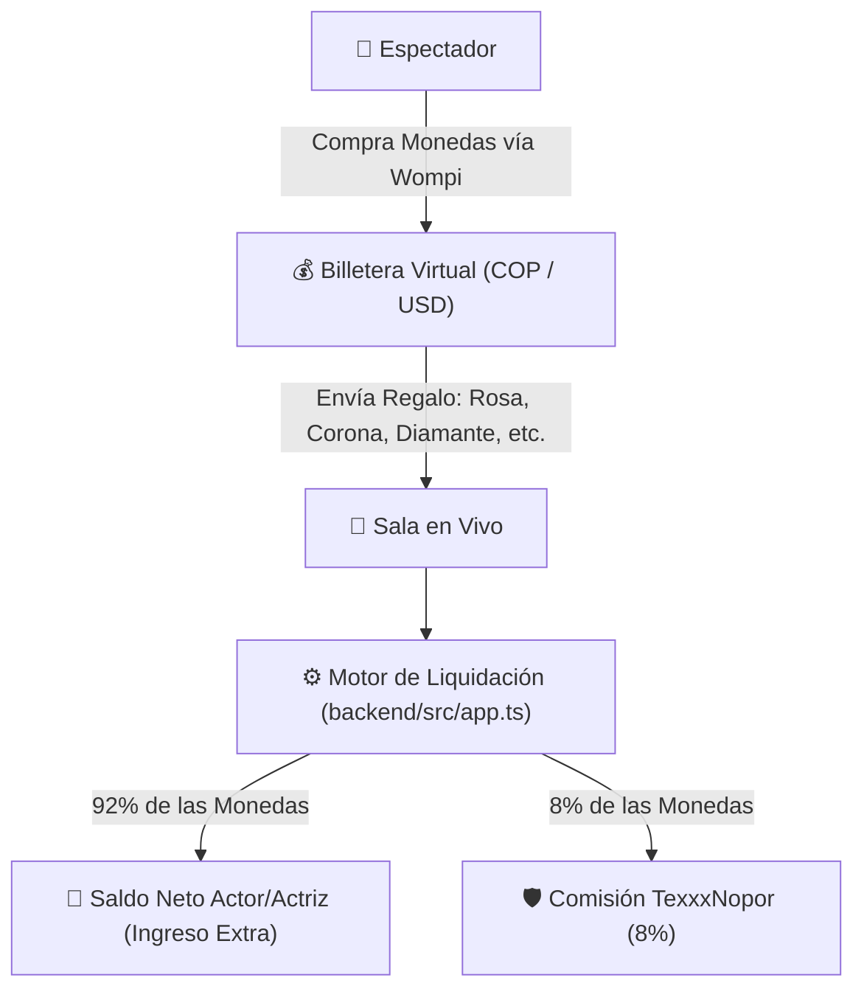
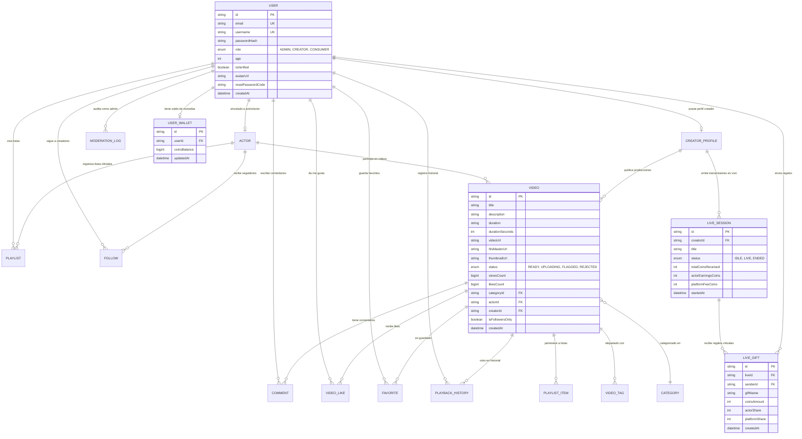

# 🏗️ Manual Técnico y Arquitectura del Sistema

**Plataforma de Streaming TexxxNopor**  
*Versión:* `1.0.3` | *Entorno:* Producción / Híbrido (Móvil & Web Universal)

---

## 1. Visión General de la Arquitectura

La plataforma TexxxNopor opera bajo una **arquitectura desacoplada y universal**, diseñada para streaming de video de alta fidelidad (4K / Full HD), baja latencia, autenticación basada en roles (RBAC), transmisiones en vivo con economía de regalos (92% actor / 8% plataforma) y pasarelas de pago en pesos colombianos (COP).



---

## 2. Principio de Arquitectura Frontend Universal

Una de las decisiones arquitectónicas fundamentales de TexxxNopor es el uso de un **Frontend Universal Centralizado** ubicado en [mobile/](file:///c:/Users/Usuario/Desktop/TexxxNopor/mobile):

1. **Una sola base de código para Móvil y Web:**
   - Mediante **React Native Web** y **Expo**, el mismo código TypeScript genera simultáneamente:
     - El archivo instalable nativo para celulares Android (`.apk`).
     - El sitio web estático de producción desplegado en [https://texxxnopor-web.onrender.com/](https://texxxnopor-web.onrender.com/).
2. **Eliminación de la carpeta legada `web/`:**
   - La carpeta previa `web/` contenía un proyecto desactualizado en Vite que duplicaba lógica y no contaba con los componentes ni animaciones del sistema. Fue eliminada para consolidar el 100% de la lógica en `mobile/`.
3. **Comportamiento adaptativo por plataforma:**
   - En celulares nativos (`Platform.OS !== 'web'`), el botón de descargar APK se oculta en la barra superior para evitar redundancia al usuario que ya tiene la app instalada.
   - En navegadores de escritorio y móviles web (`Platform.OS === 'web'`), el botón «Descargar» se renderiza de forma prominente en el header para que nuevos usuarios puedan bajar la APK.

---

## 3. Módulo de Shorts (Feed Vertical Tipo TikTok)

El módulo de videos cortos se encuentra implementado en [mobile/src/screens/TikTokShortsScreen.tsx](file:///c:/Users/Usuario/Desktop/TexxxNopor/mobile/src/screens/TikTokShortsScreen.tsx):



### Características Técnicas:
- **Encabezado Minimalista:** Pestaña única centrada **"Para ti"** y botón de regreso; se removieron pestañas secundarias ("LIVE", "Siguiendo", "Amigos") para maximizar la inmersión.
- **Sin barra inferior invasiva:** La barra tradicional de TikTok y el carrusel de sonido rotatorio fueron removidos para dejar la pantalla completamente limpia.
- **Metadatos con contraste:** El `@username`, título del video y hashtags cuentan con un gradiente oscuro inferior para asegurar legibilidad en cualquier escena.
- **Contadores Limpios:** Los contadores de Me gusta, Comentarios, Guardados y Compartir inician de forma limpia y reaccionan en tiempo real a las acciones del usuario.

---

## 4. Módulo de Transmisiones en Vivo y Economía 92% / 8%

Implementado en [TikTokLiveBroadcasterScreen.tsx](file:///c:/Users/Usuario/Desktop/TexxxNopor/mobile/src/screens/TikTokLiveBroadcasterScreen.tsx), [TikTokLiveSpectatorScreen.tsx](file:///c:/Users/Usuario/Desktop/TexxxNopor/mobile/src/screens/TikTokLiveSpectatorScreen.tsx) y [backend/src/app.ts](file:///c:/Users/Usuario/Desktop/TexxxNopor/backend/src/app.ts):

### A. Selector de Cámara Frontal / Trasera (Streamer)
- Permite al creador/actor alternar entre su cámara frontal y la cámara trasera utilizando la API estándar de medios:
  ```typescript
  navigator.mediaDevices.getUserMedia({
    video: { facingMode: currentFacing === 'user' ? 'environment' : 'user' },
    audio: true,
  })
  ```
- El botón de cambio de cámara está disponible tanto en la barra superior antes de iniciar el en vivo como en el panel flotante de herramientas durante la transmisión.
- **Modo Exclusivo "LIVE":** Se removieron los selectores "PUBLICAR" y "CREAR" para que la pantalla funcione como un estudio de streaming puro.

### B. Economía de Regalos y Reparto de Ingresos (92% / 8%)
Durante la transmisión, los espectadores pueden enviar regalos animados financiados con monedas virtuales:



- **Fórmula de Liquidación:**
  $$\text{ActorNetCoins} = \text{Math.floor}(\text{giftPrice} \times 0.92)$$
  $$\text{PlatformFeeCoins} = \text{giftPrice} - \text{ActorNetCoins}$$
- Los datos se transmiten al endpoint `POST /api/live/:liveId/gift` y se reflejan en tiempo real en la pantalla del streamer y en el resumen final de la sesión.

---

## 5. Diseño de Recuperación de Contraseña: «Hand of Cards» OTP Deck

Basado en el concepto viral de TikTok ([@settigation](https://www.tiktok.com/@settigation/video/7677577067696835848)), se implementó una interfaz de baraja de cartas animada en [mobile/src/navigation/AuthStack.tsx](file:///c:/Users/Usuario/Desktop/TexxxNopor/mobile/src/navigation/AuthStack.tsx):

```
┌─────────────────────────────────────────────────────────────┐
│ 🔴 🟡 🟢   🛡️ OTP Verification [DECK]   HTML CSS JS   localhost │
├─────────────────────────────────────────────────────────────┤
│                    COMPONENT · 100                          │
│               OTP Verification DECK                         │
│                                                             │
│   ┌─────────────────────────────────────────────────────┐   │
│   │                     ──═──                           │   │  <-- Drag handle
│   │               Enter your code                       │   │
│   │       We texted a 4-digit code to user@...          │   │
│   │                                                     │   │
│   │         ┌───┐    ┌───┐    ┌───┐    ┌───┐            │   │
│   │         │ 1 │    │ 2 │    │ 3 │    │ 4 │            │   │  <-- 4 Cartas en abanico
│   │         └───┘    └───┘    └───┘    └───┘            │   │      con física de resortes
│   │        -14deg   -4.5deg   4.5deg   14deg            │   │
│   │                                                     │   │
│   │              Didn't get a code? Resend              │   │
│   │    Type it, paste it, or hit Enter — 1234 is...     │   │
│   └─────────────────────────────────────────────────────┘   │
└─────────────────────────────────────────────────────────────┘
```

### Animaciones Físicas Implementadas con `Animated`:
1. **Reparto en Cascada (`fanAnims`):** Al enviar el correo, las cartas no aparecen estáticas: se reparten desde el centro abriéndose en arco con `Animated.stagger` y resortes amortiguados (`tension: 55`, `friction: 7`).
2. **Elevación de Carta Activa (`elevateAnims`):** La carta que espera el dígito actual se eleva **18 píxeles** (`translateY: -18px`), escala a `1.08` y resalta con borde rojo carmesí (`#E50914`).
3. **Pop de Impacto al Teclear (`popAnims`):** Cada dígito ingresado produce un rebote mecánico instantáneo (`scale: 1.26 -> 1.0`).
4. **Pulso Carmesí Continuo (`glowAnim`):** La carta activa respira con un halo luminoso cíclico.
5. **Ola de Celebración:** Al completar los 4 dígitos, las cartas ejecutan una ola en cascada confirmando el código antes de revelar los campos de cambio de contraseña.
6. **Simulación Interactiva:** Al tocar *"1234 is the good one."*, la app digita automáticamente el código de forma secuencial permitiendo observar todas las animaciones.
7. **Sincronización Backend en 4 Dígitos:** En [backend/src/app.ts](file:///c:/Users/Usuario/Desktop/TexxxNopor/backend/src/app.ts), el endpoint `/api/auth/forgot-password` genera números aleatorios en rango `1000..9999` y cuenta con timeout seguro de 3.5 segundos en [emailService.ts](file:///c:/Users/Usuario/Desktop/TexxxNopor/backend/src/services/emailService.ts) para evitar bloqueos.

---

## 6. Modelo de Base de Datos (Entity-Relationship Diagram)



---

## 7. Catálogo Completo de Endpoints REST de la API

Todos los controladores operan bajo el prefijo `/api`:

### A. Autenticación y Cuentas (`/api/auth`)
| Método | Endpoint | Acceso | Descripción |
| :--- | :--- | :--- | :--- |
| `GET` | `/api/auth/bootstrap-status` | Público | Retorna si ya existe un Administrador en la base de datos. |
| `POST` | `/api/auth/register` | Público | Registra usuario (valida +18 años). El primer usuario registrado es `ADMIN`. |
| `POST` | `/api/auth/login` | Público | Inicia sesión y genera token JWT (7 días de vigencia). |
| `POST` | `/api/auth/forgot-password` | Público | Genera código de 4 dígitos OTP para la baraja animada con timeout seguro. |
| `POST` | `/api/auth/verify-reset-code` | Público | Valida la vigencia del código de 4 dígitos. |
| `POST` | `/api/auth/reset-password` | Público | Actualiza la contraseña en base de datos. |
| `GET` | `/api/auth/me` | JWT | Retorna el perfil completo del usuario en sesión. |

### B. Transmisiones en Vivo y Regalos (`/api/live` & `/api/wallet`)
| Método | Endpoint | Acceso | Descripción |
| :--- | :--- | :--- | :--- |
| `POST` | `/api/live/:liveId/gift` | JWT | Envía un regalo en vivo: reparte 92% al actor y 8% a la plataforma. |
| `POST` | `/api/wallet/recharge-coins`| JWT | Registra recarga de paquete de monedas tras confirmación Wompi. |
| `GET` | `/api/wallet/balance` | JWT | Consulta el saldo actual de monedas del usuario. |

### C. Videos y Streaming (`/api/videos`)
| Método | Endpoint | Acceso | Descripción |
| :--- | :--- | :--- | :--- |
| `GET` | `/api/videos` | Público | Obtiene catálogo con filtros de categoría, búsqueda y tags. |
| `GET` | `/api/videos/:id` | Público | Retorna detalle del video y suma contador de vistas. |
| `POST` | `/api/videos/:id/like` | JWT | Alterna estado de Me Gusta (Like/Unlike). |
| `POST` | `/api/videos/:id/favorite` | JWT | Guarda o remueve de Ver Más Tarde. |
| `POST` | `/api/videos/:id/history` | JWT | Guarda segundo exacto de reproducción en historial. |
| `GET` | `/api/videos/:id/comments` | Público | Lista los comentarios del video. |
| `POST` | `/api/videos/:id/comments` | JWT | Publica un nuevo comentario. |

### D. Pasarela Wompi Bancolombia (`/api/wompi`)
| Método | Endpoint | Acceso | Descripción |
| :--- | :--- | :--- | :--- |
| `GET` | `/api/wompi/banks` | Público | Lista de instituciones financieras colombianas PSE. |
| `POST` | `/api/wompi/create-transaction` | JWT | Crea transacción firmada con SHA-256 (PSE, Nequi, Tarjetas). |
| `GET` | `/api/wompi/status/:id` | JWT | Consulta el estado en tiempo real de una transacción. |
| `POST` | `/api/wompi/webhook` | Wompi IP | Webhook automático que activa la cuenta VIP tras pago exitoso. |

### E. Control de Versiones y Descargas APK (`/api/app` & `/download`)
| Método | Endpoint | Acceso | Descripción |
| :--- | :--- | :--- | :--- |
| `GET` | `/api/app/version-check` | Público | Retorna estado de versión (`isOutdated: true`, `webUrl`). |
| `GET` | `/download` | Público | Entrega `TexxxNopor.apk` local o redirige a `APP_UPDATE_URL`. |
| `GET` | `/api/app/download-apk` | Público | Alias de descarga directa con fallback a la nube. |

---

## 8. Seguridad Criptográfica y Resiliencia

1. **Tokens JWT:** Firmados con clave secreta `JWT_SECRET` mediante algoritmo `HS256`, incluyendo payload de `userId`, `email` y `role`.
2. **Cifrado de Claves:** Implementado con **bcrypt** (10 salt rounds).
3. **Firma de Transacciones Wompi:**
   $$\text{Firma SHA-256} = \text{SHA256}(\text{referencia} + \text{montoEnCentavos} + \text{moneda} + \text{integritySecret})$$
4. **Resiliencia en Envío de Correos:** En [backend/src/services/emailService.ts](file:///c:/Users/Usuario/Desktop/TexxxNopor/backend/src/services/emailService.ts), las llamadas SMTP están envueltas en un `Promise.race` con un límite estricto de **3.5 segundos**, garantizando que el usuario jamás experimente pantallas congeladas.
