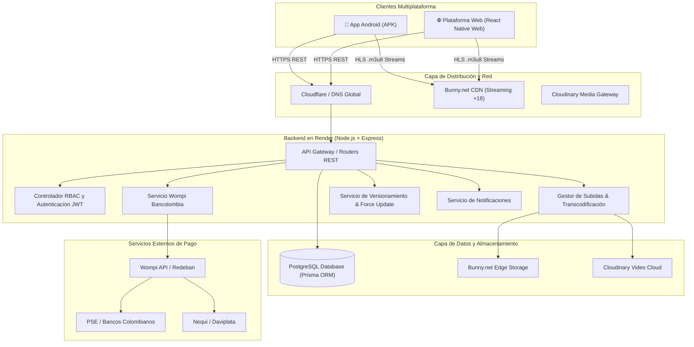
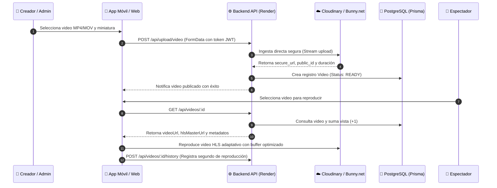
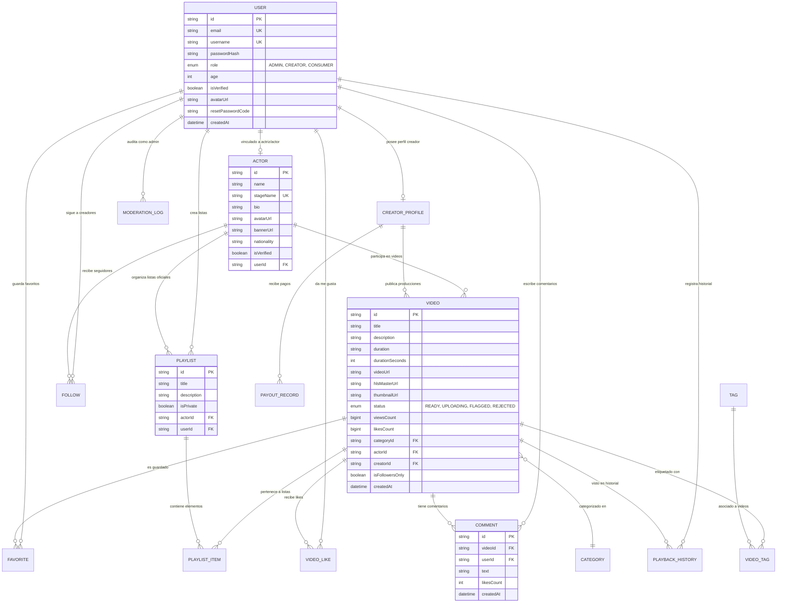

# 🏗️ Manual Técnico y Arquitectura del Sistema

**Plataforma de Streaming TexxxNopor**  
*Versión:* `1.0.2` | *Entorno:* Producción / Híbrido (Móvil & Web)

---

## 1. Visión General de la Arquitectura

La plataforma TexxxNopor está construida bajo una **arquitectura en capas moderna y desacoplada**, diseñada para ofrecer transmisión de video de alta definición (4K / Full HD) con baja latencia, autenticación robusta basada en roles (RBAC) y pagos en moneda local colombiana (COP).

---

## 2. Diagrama de Flujo: Ingesta, Publicación y Streaming HLS

---

## 3. Modelo de Base de Datos (Entity-Relationship Diagram)

La base de datos relacional opera sobre **PostgreSQL**, gestionada a través de **Prisma ORM**:

---

## 4. Catálogo Completo de Endpoints REST de la API

La API expone los siguientes controladores principales bajo el prefijo `/api`:

### A. Autenticación y Cuentas (`/api/auth`)
| Método | Endpoint | Acceso | Descripción |
| :--- | :--- | :--- | :--- |
| `GET` | `/api/auth/bootstrap-status` | Público | Indica si existe un Administrador en el sistema. |
| `POST` | `/api/auth/register` | Público | Registra usuario (valida +18 años). El primer usuario registrado es `ADMIN`. |
| `POST` | `/api/auth/login` | Público | Inicia sesión y genera token JWT (duración 7 días). |
| `POST` | `/api/auth/social` | Público | Autenticación con Google y Facebook. |
| `POST` | `/api/auth/forgot-password` | Público | Genera código de 6 dígitos para recuperación. |
| `POST` | `/api/auth/verify-reset-code` | Público | Valida la vigencia del código de 6 dígitos. |
| `POST` | `/api/auth/reset-password` | Público | Actualiza la contraseña con el código validado. |
| `GET` | `/api/auth/me` | JWT | Retorna el perfil completo del usuario autenticado. |

### B. Videos y Streaming (`/api/videos`)
| Método | Endpoint | Acceso | Descripción |
| :--- | :--- | :--- | :--- |
| `GET` | `/api/videos` | Público | Obtiene el feed de videos con filtros (`category`, `q`, `tag`). |
| `GET` | `/api/videos/:id` | Público | Obtiene detalle del video y suma contador de vistas. |
| `POST` | `/api/videos/:id/like` | JWT | Alterna estado de "Me Gusta" (Like/Unlike). |
| `POST` | `/api/videos/:id/favorite` | JWT | Guarda/Elimina de "Ver Más Tarde". |
| `POST` | `/api/videos/:id/history` | JWT | Guarda progreso de reproducción en segundos. |
| `GET` | `/api/videos/:id/comments` | Público | Lista los comentarios de un video. |
| `POST` | `/api/videos/:id/comments` | JWT | Publica un nuevo comentario. |

### C. Pasarela de Pagos Wompi (`/api/wompi`)
| Método | Endpoint | Acceso | Descripción |
| :--- | :--- | :--- | :--- |
| `GET` | `/api/wompi/banks` | Público | Lista de bancos colombianos PSE con códigos ACH. |
| `POST` | `/api/wompi/create-transaction` | JWT | Crea transacción en Wompi (PSE, Nequi, Tarjetas). |
| `GET` | `/api/wompi/status/:transactionId`| JWT | Consulta estado en tiempo real de una transacción. |
| `POST` | `/api/wompi/webhook` | Wompi IP | Webhook automático para activación de VIP. |

### D. Control de Versiones y Caducidad (`/api/app`)
| Método | Endpoint | Acceso | Descripción |
| :--- | :--- | :--- | :--- |
| `GET` | `/api/app/version-check` | Público | Verifica si la versión instalada ha caducado (`isOutdated: true`). |

### E. Actores y Creadores (`/api/actors` & `/api/admin/actors`)
| Método | Endpoint | Acceso | Descripción |
| :--- | :--- | :--- | :--- |
| `GET` | `/api/actors` | Público | Lista todos los actores/actrices con conteo de videos. |
| `GET` | `/api/actors/:id` | Público | Perfil completo del actor con videos, playlists y seguidores. |
| `POST` | `/api/admin/actors` | ADMIN | Registra un nuevo actor con foto y biografía. |
| `PUT` | `/api/admin/actors/:id` | ADMIN / Creador | Actualiza datos del perfil del actor. |
| `DELETE`| `/api/admin/actors/:id` | ADMIN | Elimina un actor y reasigna videos a independiente. |

---

## 5. Protocolos de Seguridad y Cifrado

1. **Tokens de Acceso JWT (JSON Web Tokens):**
   - Firmados con algoritmo `HS256` utilizando la clave `JWT_SECRET`.
   - Contienen `userId`, `email` y `role`.
   - Expiración estándar de 7 días.

2. **Cifrado de Contraseñas:**
   - Implementado con **bcrypt** con factor de costo 10 (salt rounds).
   - Las contraseñas en texto plano nunca se almacenan ni se transmiten en logs.

3. **Cifrado de Firmas de Transacción Wompi:**
   - Firma criptográfica **SHA-256** calculada en el backend antes del envío:
     $$\text{Signature} = \text{SHA256}(\text{reference} + \text{amountInCents} + \text{currency} + \text{integritySecret})$$

4. **Filtro de Edad (+18 Gate):**
   - Validación forzosa tanto en el cliente como en el backend. Registros con edad $< 18$ o confirmación falsa son rechazados con código HTTP 400.
