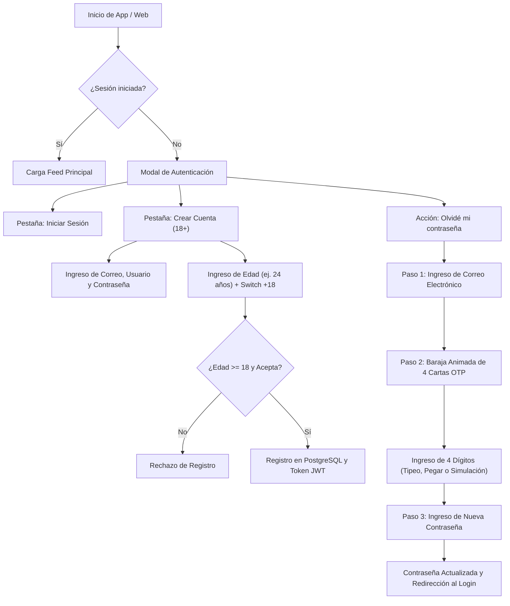

# 📱 Manual Funcional y Guía de Usuario

**Plataforma de Streaming TexxxNopor**  
*Versión:* `1.0.3` | *Audiencia:* Usuarios, Creadores, Modelos y Administradores

---

## 1. Matriz de Roles y Permisos (RBAC)

La plataforma cuenta con un sistema de Control de Acceso Basado en Roles con 3 niveles:

| Funcionalidad / Módulo | 👥 Espectador (`CONSUMER`) | 🎬 Creador / Actor (`CREATOR`) | 👑 Administrador (`ADMIN`) |
| :--- | :---: | :---: | :---: |
| **Ver catálogo público y reproductor 4K** | ✅ | ✅ | ✅ |
| **Ver feed vertical de Shorts ("Para ti")** | ✅ | ✅ | ✅ |
| **Dar Likes, Comentar y Guardar Favoritos** | ✅ | ✅ | ✅ |
| **Crear Listas de Reproducción Personales** | ✅ | ✅ | ✅ |
| **Comprar Monedas y Enviar Regalos en Vivo** | ✅ | ✅ | ✅ |
| **Suscribirse a Membresía RED VIP ($10.000 COP)** | ✅ | ✅ | ✅ |
| **Editar Perfil Propio y Avatar** | ✅ | ✅ | ✅ |
| **Transmitir en Vivo (Cámara Frontal / Trasera)** | ❌ | ✅ | ✅ |
| **Recibir el 92% de Ganancias por Regalos** | ❌ | ✅ | ✅ |
| **Publicar Videos Largos en Estudio** | ❌ | ✅ | ✅ |
| **Gestionar Perfil de Actor/Actriz Propio** | ❌ | ✅ | ✅ |
| **Panel de Control y Analíticas Globales** | ❌ | ❌ | ✅ |
| **Crear, Editar y Eliminar Actores / Modelos** | ❌ | ❌ | ✅ |
| **Moderar y Eliminar Videos de la Plataforma** | ❌ | ❌ | ✅ |
| **Gestionar Usuarios y Asignar Roles** | ❌ | ❌ | ✅ |

> [!NOTE]
> **Mecanismo de Bootstrap:** La base de datos asigna automáticamente el rol de **Administrador (`ADMIN`)** al primer usuario registrado en la plataforma. Los siguientes usuarios reciben el rol de **Espectador (`CONSUMER`)** de forma predeterminada.

---

## 2. Flujo de Autenticación y Recuperación de Contraseña

### Guía de Recuperación con la Baraja Animada («Hand of Cards» OTP Deck):
Inspirada en el diseño moderno de TikTok ([@settigation](https://www.tiktok.com/@settigation/video/7677577067696835848)):
1. **Paso 1 (Ingreso de Correo):** Digita tu correo y presiona **"Enviar código OTP"**. El backend enviará un código de 4 números con respuesta rápida garantizada (máximo 3.5 segundos).
2. **Paso 2 (La Baraja de 4 Naipes):**
   - Al validarse el correo, verás cómo 4 naipes se despliegan desde el centro abriéndose en un abanico dinámico (`-14°`, `-4.5°`, `+4.5°`, `+14°`).
   - La primera carta se levantará automáticamente **18 píxeles hacia arriba** con un halo rojo carmesí, lista para recibir el primer dígito.
   - Conforme escribes cada número, la carta actual realiza un rebote mecánico (*Spring Pop*) y la siguiente carta se levanta.
   - **Atajo interactivo:** Puedes tocar el texto inferior *"Type it, paste it, or hit Enter — **1234 is the good one.**"* para que la aplicación digite el código automáticamente de forma animada.
3. **Paso 3 (Nueva Contraseña):** Al ingresar los 4 dígitos, las cartas realizan una ola de confirmación y aparecen los campos para ingresar tu nueva contraseña (mínimo 6 caracteres) y confirmarla.

---

## 3. Módulo de Shorts (Feed de Videos Verticales)

Al presionar el icono de **Shorts** en la barra de navegación:

1. **Pestaña Única "Para ti":**
   - La interfaz muestra únicamente la pestaña centrada **"Para ti"** con el botón para regresar, eliminando elementos distractores como pestañas de "Siguiendo" o "Amigos".
2. **Controles Táctiles y Gestos Fluidos:**
   - **Deslizar hacia arriba / abajo:** Cambia de forma instantánea al video siguiente o anterior con animación vertical nativa (`PanResponder`).
   - **Toque simple (1 Tap):** Pausa o reanuda la reproducción del video, mostrando un icono animado central de Play/Pausa.
   - **Doble toque rápido (Double Tap):** Da "Me gusta" al video de inmediato, haciendo flotar un corazón carmesí animado en la pantalla y sumando +1 al contador.
3. **Contadores de Interacción Reales:**
   - Cada video cuenta con contadores de **Me gusta**, **Comentarios**, **Guardar en Favoritos** y **Compartir** que reaccionan inmediatamente a la interacción del usuario.
4. **Información del Creador:**
   - En la esquina inferior izquierda se muestra el `@nombredeusuario` del actor o creador, el título de la producción y los hashtags (ej. `#4k #estreno`) con alto contraste sobre la escena.

---

## 4. Transmisiones en Vivo (Live Studio y Espectadores)

El sistema de en vivo de TexxxNopor ofrece una experiencia interactiva orientada a la monetización directa de actores y modelos:

### A. Para el Creador / Actor (Estudio de Emisión)
1. **Acceso Exclusivo LIVE:** Desde el panel de creador se accede al modo puro de transmisión en vivo (se eliminaron opciones de "PUBLICAR" para que la pantalla sea 100% de transmisión).
2. **Cambio de Cámara Frontal / Trasera:**
   - Puedes cambiar libremente entre la cámara frontal (ideal para interactuar con la audiencia) y la cámara trasera (para mostrar el entorno) presionando el botón de cámara en la barra superior o en el panel flotante.
3. **Monitoreo de Audiencia y Ganancias:**
   - Visualización de espectadores en tiempo real.
   - Notificación animada cada vez que un usuario envía un regalo.
   - Contador de monedas acumuladas durante la transmisión.

### B. Para el Espectador (Interacción y Regalos)
1. **Visualización y Chat en Tiempo Real:** Los espectadores pueden interactuar en el chat público y reaccionar al en vivo.
2. **Billetera de Monedas Virtuales:**
   - Si no tienes monedas, puedes abrir el modal de recarga y seleccionar paquetes desde 70 hasta 7.000 monedas, pagando en pesos colombianos (COP) mediante **Nequi**, **PSE**, **Bancolombia** o **Tarjetas**.
3. **Catálogo de Regalos Animados:**
   - Selecciona rosas, corazones de fuego, coronas o diamantes para enviarlos en vivo.
   - El regalo aparece como animación en la pantalla de todos los espectadores y emite una alerta especial al streamer.

### C. Reparto de Ingresos (92% Actor / 8% TexxxNopor)
- Por cada regalo enviado, el sistema descuenta las monedas del espectador y liquida:
  - **92%** de las monedas se abonan directamente como **ganancia neta al saldo del actor/actriz**.
  - **8%** se retiene como comisión de infraestructura para la plataforma TexxxNopor.
- Al finalizar el en vivo, el creador puede ver el resumen total de monedas recibidas y solicitar su pago.

---

## 5. Guía de Pantallas Principales

### A. Pantalla Principal (Home / Feed 4K)
- **Barra Superior:** Logo oficial, selector de categorías (*Para ti, Nuevos, Tendencias, Más Vistos, 4K*) y acceso al menú lateral.
- **Botón «Descargar» Inteligente:**
  - Si navegas desde la web ([https://texxxnopor-web.onrender.com/](https://texxxnopor-web.onrender.com/)), verás el botón «Descargar» en la esquina superior derecha para bajar la aplicación móvil.
  - Si ya estás dentro de la app instalada en tu celular, el botón se oculta automáticamente.
- **Tarjetas de Video:** Miniaturas en alta definición con etiqueta de duración, vistas acumuladas y botón para ver más tarde.

### B. Reproductor HLS de Alta Fidelidad (VideoDetailPlayerScreen)
- **Resolución Adaptativa y Control de Velocidad:** Opciones desde $0.5\times$ hasta $2.0\times$.
- **Doble Toque:** Adelantar o retroceder 10 segundos.
- **Interacciones:** Me gusta, guardar, comentarios y carrusel de videos relacionados.

### C. Módulo de Actores y Modelos (ActorsScreen)
- Catálogo de actrices y actores con fotos de portada, biografía, número de seguidores, botón para Seguir y listas de reproducción oficiales.

### D. Estudio de Publicación (PublishScreen — Creadores & Admins)
- Selector de archivos de video para carga directa hacia Cloudinary / Bunny.net con barra de progreso en porcentaje.
- Formulario de metadatos: Título, sinopsis, categoría, actor asociado, etiquetas y miniatura personalizada.

### E. Panel de Cuenta y Ajustes (AccountMenuModal)
- Menú lateral deslizable (*Drawer*) con accesos directos a:
  - Mis Videos Favoritos y Ver Más Tarde.
  - Historial de Reproducción con opción de vaciado.
  - Mis Listas de Reproducción.
  - Ajustes de cuadrícula (1, 2 o 4 columnas) y reproducción automática.
  - Pie informativo con la versión instalada (`TexxxNopor Mobile v1.0.3`).

---

## 6. Membresía VIP RED ($10.000 COP / mes)

Al presionar el banner rojo **"CONSIGUE EXCLUSIVIDAD"**:

1. **Beneficios Exclusivos:**
   - 📺 **Calidad 4K Ultra HD:** Acceso sin compresión a todas las producciones.
   - 🚫 **100% Sin Publicidad:** Cero anuncios en videos largos y shorts.
   - ✨ **Contenido Exclusivo RED:** Escenas VIP y estrenos anticipados.
   - 📥 **Descargas Ilimitadas:** Guardar producciones para ver sin conexión.
   - 🛡️ **Facturación Discreta:** En extractos bancarios aparece como *"Servicios Digitales Seguros"*.

2. **Planes Disponibles en Pesos Colombianos:**
   - **1 Mes VIP:** **$10.000 COP** *(Plan Base Recomendado)*
   - **3 Meses VIP:** **$25.000 COP** *(Ahorra 15%)*
   - **6 Meses VIP:** **$45.000 COP** *(Ahorra 25%)*
   - **12 Meses VIP:** **$80.000 COP** *(Ahorra 35%)*

3. **Activación Instantánea:** Procesada mediante **Wompi Bancolombia** emitiendo el comprobante `TX-WMP-...` y activando el sello VIP inmediatamente en la cuenta.
