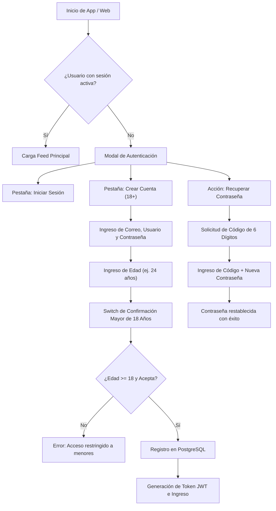

# 📱 Manual Funcional y Guía de Usuario

**Plataforma de Streaming TexxxNopor**  
*Versión:* `1.0.2` | *Audiencia:* Usuarios, Creadores y Administradores

---

## 1. Matriz de Roles y Permisos (RBAC)

La plataforma cuenta con un sistema de Control de Acceso Basado en Roles con 3 niveles:

| Funcionalidad / Módulo | 👥 Espectador (`CONSUMER`) | 🎬 Creador / Actor (`CREATOR`) | 👑 Administrador (`ADMIN`) |
| :--- | :---: | :---: | :---: |
| **Ver catálogo público y reproductor 4K** | ✅ | ✅ | ✅ |
| **Dar Likes, Comentar y Guardar Favoritos** | ✅ | ✅ | ✅ |
| **Crear Listas de Reproducción Personales** | ✅ | ✅ | ✅ |
| **Suscribirse a Membresía RED VIP ($10.000 COP)** | ✅ | ✅ | ✅ |
| **Editar Perfil Propio y Avatar** | ✅ | ✅ | ✅ |
| **Publicar Videos y Subir a Cloudinary/Bunny** | ❌ | ✅ | ✅ |
| **Gestionar Perfil de Actor/Actriz Propio** | ❌ | ✅ | ✅ |
| **Panel de Control y Analíticas Globales** | ❌ | ❌ | ✅ |
| **Crear y Eliminar Actores / Modelos** | ❌ | ❌ | ✅ |
| **Moderar y Eliminar Videos de la Plataforma** | ❌ | ❌ | ✅ |
| **Gestionar Usuarios y Asignar Roles** | ❌ | ❌ | ✅ |

> [!NOTE]
> **Mecanismo de Bootstrap:** La base de datos asigna automáticamente el rol de **Administrador (`ADMIN`)** al primer usuario registrado en la plataforma. Los siguientes usuarios reciben el rol de **Espectador (`CONSUMER`)** de forma predeterminada.

---

## 2. Flujo de Autenticación y Verificación de Edad (+18)

---

## 3. Guía de Pantallas y Funcionalidades

### A. Pantalla Principal (Home / Feed 4K)
- **Barra Superior:** Logo de la marca, botón de búsqueda rápida, selector de filtros por categoría y acceso al menú lateral.
- **Filtros Dinámicos:** Pestañas superiores que permiten filtrar entre *Para ti, Nuevos, Tendencias, Más Vistos, 4K Ultra HD*.
- **Tarjetas de Video:**
  - Miniatura en alta resolución con insignia de duración.
  - Título, nombre del actor/actriz verificado y avatar.
  - Vistas acumuladas y tiempo desde la publicación.
  - Botón de opciones rápidas (Compartir, Guardar en Ver más tarde).

### B. Reproductor HLS de Alta Fidelidad (VideoDetailPlayerScreen)
- **Streaming Adaptativo:** Selector de resolución y velocidad de reproducción ($0.5\times$, $0.75\times$, $1.0\times$, $1.25\times$, $1.5\times$, $2.0\times$).
- **Controles Táctiles:** Doble toque para avanzar/retroceder 10 segundos, barra de progreso interactiva con segundo exacto.
- **Interacciones en Tiempo Real:**
  - Botón de **Me Gusta** con contador dinámico.
  - Botón de **Guardar** (Ver más tarde).
  - Caja de **Comentarios** con publicación en tiempo real y contador.
  - Carrusel de **Videos Relacionados** recomendados.

### C. Módulo de Actores y Modelos (ActorsScreen)
- Listado de actrices y actores verificados con avatar y fotos de portada.
- Perfil individual del actor con biografía, nacionalidad, número de seguidores y catálogo de videos en los que participa.
- Botón para **Seguir / Dejar de seguir**.
- Pestaña de **Playlists Oficiales** organizadas por el actor o creador.

### D. Estudio de Publicación (PublishScreen — Creadores & Admins)
- **Selector de Video:** Carga directa de archivos desde la galería del celular o explorador de archivos en PC.
- **Barra de Progreso:** Muestra el porcentaje de subida en tiempo real hacia Cloudinary / Bunny.net.
- **Campos de Metadatos:**
  - Título del video.
  - Descripción y sinopsis.
  - Selector de Categoría.
  - Selector de Actor/Actriz protagonista.
  - Etiquetas / Hashtags (ej. `#4k #estreno`).
  - Selector de Miniatura personalizada.

### E. Panel de Control y Administración (AccountMenuModal)
- Menú lateral deslizable (*Drawer*) con acceso rápido a:
  - **Mi Panel de Instrumentos:** Métricas de videos vistos, likes dados y suscripciones activas.
  - **Mis Videos Favoritos:** Lista de videos marcados con "Me Gusta".
  - **Historial de Reproducción:** Lista de videos reproducidos con botón para limpiar historial.
  - **Ver Más Tarde:** Colección personal de videos guardados.
  - **Mis Listas:** Creador y reproductor de listas de reproducción personalizadas.
  - **Ajustes de UI:** Configuración de columnas (4, 2 o 1 columna), vista previa automática de video y traducciones.
  - **Pie de Versión:** Indicador visible de la versión instalada (`TexxxNopor Mobile v1.0.2`).

---

## 4. Membresía VIP RED ($10.000 COP / mes)

Al presionar el banner rojo **"CONSIGUE EXCLUSIVIDAD"** en el perfil o menú:

1. **Beneficios Exclusivos:**
   - 📺 **Calidad 4K Ultra HD:** Acceso sin compresión a todas las producciones.
   - 🚫 **100% Sin Publicidad:** Cero interrupciones ni anuncios invasivos.
   - ✨ **Contenido Exclusivo RED:** Escenas VIP y estrenos anticipados.
   - 📥 **Descargas Ilimitadas:** Guardar producciones para ver sin internet.
   - 🛡️ **Facturación Discreta:** En los extractos bancarios aparecerá como *"Servicios Digitales Seguros"*.

2. **Planes Disponibles en Pesos Colombianos:**
   - **1 Mes VIP:** **$10.000 COP** *(Plan Recomendado)*
   - **3 Meses VIP:** **$25.000 COP** *(Ahorra 15%)*
   - **6 Meses VIP:** **$45.000 COP** *(Ahorra 25%)*
   - **12 Meses VIP:** **$80.000 COP** *(Ahorra 35%)*

3. **Activación:** Se procesa a través de la pasarela oficial de **Wompi Bancolombia** emitiendo el comprobante de pago `TX-WMP-...` y activando el sello verificado en la cuenta del usuario.
