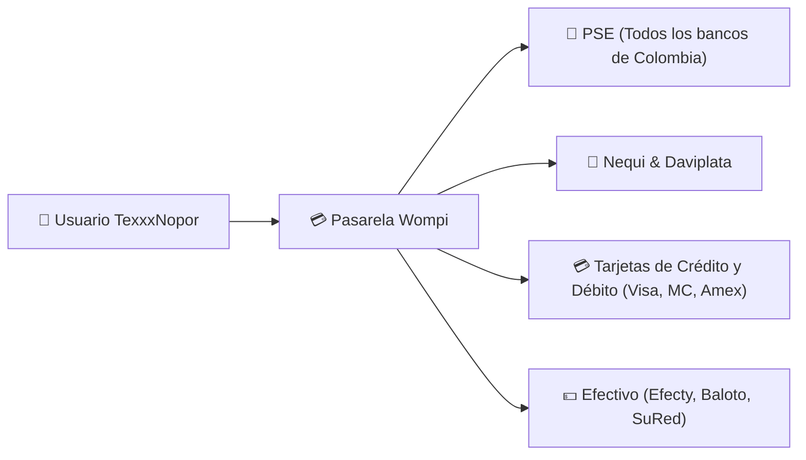
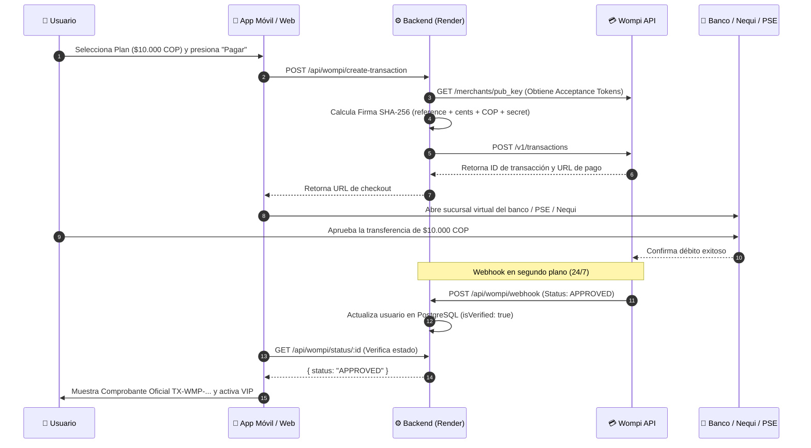

# 💳 Manual de Pasarela de Pagos Wompi (Bancolombia)

**Plataforma de Streaming TexxxNopor**  
*Pasarela Oficial:* Wompi Colombia | *Moneda Base:* Pesos Colombianos (COP)

---

## 1. Visión General de Wompi en TexxxNopor

**Wompi** es la pasarela de pagos digital de **Bancolombia**, líder en Colombia para el procesamiento seguro de transacciones en línea. Permite a los usuarios de TexxxNopor adquirir su membresía VIP RED pagando directamente con sus cuentas bancarias, billeteras digitales y tarjetas nacionales.

### Medios de Pago Integrados



---

## 2. Enlace Oficial de Pago Directo (Checkout Link)

La plataforma cuenta con un enlace de checkout oficial generado directamente desde el portal de Wompi Comercios:

> 🔗 **Enlace Oficial de Checkout:**  
> **`https://checkout.wompi.co/l/VPOS_4BlRq7`**

### Comportamiento en la Aplicación y en la Web:
1. Al seleccionar el plan mensual de **$10.000 COP** y presionar **"Pagar Ahora"**, la aplicación abre de forma segura este enlace mediante el navegador integrado (`expo-web-browser` en móvil o ventana emergente en web).
2. El usuario selecciona su método de pago preferido (PSE, Nequi, Tarjeta).
3. Una vez completado el pago, el usuario regresa a la plataforma con su membresía VIP RED activada.

---

## 3. Matriz de Planes y Precios en Pesos Colombianos (COP)

| Identificador Plan | Nombre Público | Precio (COP) | Monto en Centavos Wompi | Facturación |
| :--- | :--- | :--- | :--- | :--- |
| `1_month` | **1 Mes VIP (Recomendado)** | **$10.000 COP** | `1000000` | $10.000 COP facturado al mes |
| `3_months` | **3 Meses VIP** | **$25.000 COP** | `2500000` | $8.333 COP / mes ($25.000 COP total) |
| `6_months` | **6 Meses VIP** | **$45.000 COP** | `4500000` | $7.500 COP / mes ($45.000 COP total) |
| `12_months` | **12 Meses VIP (Anual)** | **$80.000 COP** | `8000000` | $6.666 COP / mes ($80.000 COP total) |

---

## 4. Ciclo de Vida de una Transacción y Webhook Asíncrono



---

## 5. Configuración de Credenciales de Wompi en Render

Para operar tanto en modo de pruebas (**Sandbox**) como en **Producción**, debes configurar las siguientes variables de entorno en tu panel de **[render.com](https://render.com)** $\rightarrow$ Servicio `texxxnopor-backend` $\rightarrow$ Pestaña **Environment**:

### A. Variables para Modo Pruebas (Sandbox)
```env
WOMPI_API_URL="https://sandbox.wompi.co/v1"
WOMPI_PUBLIC_KEY="pub_test_XXXXX"
WOMPI_PRIVATE_KEY="prv_test_XXXXX"
WOMPI_INTEGRITY_SECRET="integrity_test_XXXXX"
WOMPI_EVENTS_SECRET="events_test_XXXXX"
```

### B. Variables para Modo Producción (Cobros Reales)
Una vez tu comercio esté aprobado en [comercios.wompi.co](https://comercios.wompi.co):
```env
WOMPI_API_URL="https://production.wompi.co/v1"
WOMPI_PUBLIC_KEY="pub_prod_XXXXX"
WOMPI_PRIVATE_KEY="prv_prod_XXXXX"
WOMPI_INTEGRITY_SECRET="integrity_prod_XXXXX"
WOMPI_EVENTS_SECRET="events_prod_XXXXX"
```

---

## 6. Configuración de la URL de Webhook en el Portal de Wompi

Para que Wompi notifique a tu backend en tiempo real cuando un pago sea aprobado:

1. Inicia sesión en **[comercios.wompi.co](https://comercios.wompi.co)**.
2. Ve a la sección **Desarrolladores** $\rightarrow$ **URL de Eventos / Webhook**.
3. Pega la siguiente URL:
   ```
   https://texxxnopor-backend.onrender.com/api/wompi/webhook
   ```
4. Guarda los cambios. A partir de ese momento, cualquier pago aprobado por un usuario actualizará automáticamente su cuenta sin necesidad de intervención manual.

---

## 7. Tarjetas y Cuentas de Prueba para Sandbox

| Método de Pago | Número de Prueba | CVC | Vencimiento | Resultado Esperado |
| :--- | :--- | :---: | :---: | :--- |
| **Tarjeta Aprobada** | `4242 4242 4242 4242` | `123` | `12/28` | ✅ **APPROVED** |
| **Tarjeta Declinada**| `4111 1111 1111 1111` | `123` | `12/28` | ❌ **DECLINED** |
| **Nequi Aprobado**   | `3991111111` | N/A | N/A | ✅ **APPROVED** (Código push) |
| **Nequi Declinado**  | `3992222222` | N/A | N/A | ❌ **DECLINED** |
