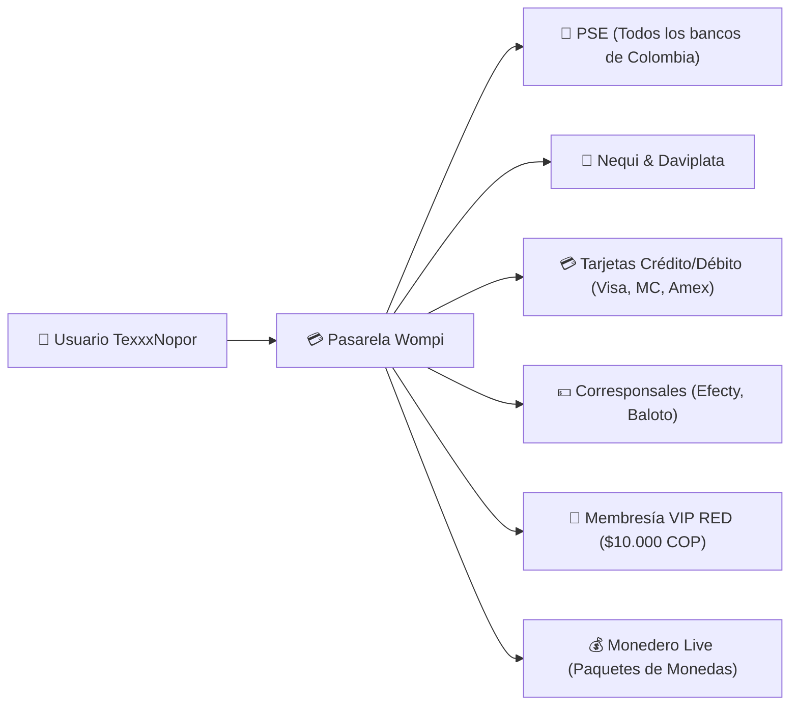
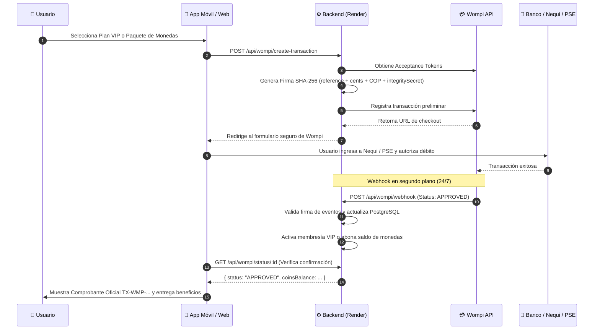

# 💳 Manual de Pasarela de Pagos Wompi (Bancolombia) y Monedero Live

**Plataforma de Streaming TexxxNopor**  
*Pasarela Oficial:* Wompi Colombia | *Moneda Base:* Pesos Colombianos (COP)

---

## 1. Visión General de Wompi en TexxxNopor

**Wompi** es la pasarela de pagos digital de **Bancolombia**, líder en Colombia para el procesamiento seguro de transacciones en línea. En TexxxNopor, Wompi gestiona dos canales de monetización principales:
1. **Suscripciones a Membresías VIP RED:** Cobro recurrente o pago único de membresías para acceso a calidad 4K, contenido exclusivo y descargas.
2. **Recargas del Monedero Virtual de Monedas:** Adquisición de paquetes de monedas para que los usuarios envíen regalos a los actores y modelos durante las transmisiones en vivo (con reparto 92% actor / 8% plataforma).



---

## 2. Enlace Oficial de Pago Directo (Checkout Link)

La plataforma cuenta con un enlace de checkout directo generado desde el portal de Wompi Comercios:

> 🔗 **Enlace Oficial de Checkout:**  
> **`https://checkout.wompi.co/l/VPOS_4BlRq7`**

### Integración en la App Móvil y en la Web:
- **En la App Android:** Al seleccionar un plan VIP y presionar *"Pagar Ahora"*, la aplicación abre el checkout de forma segura a través de `expo-web-browser`.
- **En la Web ([texxxnopor-web.onrender.com](https://texxxnopor-web.onrender.com/)):** Se abre la ventana emergente segura con el link oficial de Wompi.
- Al completarse el débito bancario, Wompi notifica a nuestro backend mediante un Webhook y el usuario recibe su activación sin esperas.

---

## 3. Matriz de Membresías VIP en Pesos Colombianos (COP)

| Identificador Plan | Nombre Público | Precio (COP) | Monto en Centavos Wompi | Descripción / Ahorro |
| :--- | :--- | :--- | :--- | :--- |
| `1_month` | **1 Mes VIP (Recomendado)** | **$10.000 COP** | `1000000` | Plan base mensual completo |
| `3_months` | **3 Meses VIP** | **$25.000 COP** | `2500000` | $8.333 COP / mes (Ahorra 15%) |
| `6_months` | **6 Meses VIP** | **$45.000 COP** | `4500000` | $7.500 COP / mes (Ahorra 25%) |
| `12_months` | **12 Meses VIP (Anual)** | **$80.000 COP** | `8000000` | $6.666 COP / mes (Ahorra 35%) |

---

## 4. Monedero Virtual de Monedas para Transmisiones en Vivo

Para fomentar la interacción y permitir que los usuarios premien a sus actores y modelos favoritos durante las transmisiones en vivo, se implementó un sistema de billetera virtual de monedas:

### Matriz de Paquetes de Monedas:
| Paquete | Monedas | Precio (COP) | Referencia USD | Método de Pago Recomendado |
| :--- | :--- | :--- | :--- | :--- |
| **Básico** | **70 monedas** | **$3.500 COP** | ~$0.85 USD | Nequi / Daviplata / PSE |
| **Popular** | **350 monedas** | **$17.500 COP** | ~$4.20 USD | Nequi / PSE / Tarjeta |
| **Estándar** | **700 monedas** | **$35.000 COP** | ~$8.40 USD | PSE / Tarjeta Crédito |
| **Plus** | **1.400 monedas** | **$68.000 COP** | ~$16.50 USD | PSE / Tarjeta Débito/Crédito |
| **Ultra** | **3.500 monedas** | **$165.000 COP** | ~$40.00 USD | PSE / Tarjeta |
| **VIP Gold** | **7.000 monedas** | **$320.000 COP** | ~$77.00 USD | PSE / Tarjeta |

### Flujo Económico de los Regalos en Vivo (92% / 8%):
1. El espectador selecciona un regalo durante el en vivo (ej. *Rosa: 10 monedas, Corona: 500 monedas, Diamante: 1.000 monedas*).
2. El sistema verifica que el usuario tenga saldo suficiente en su monedero (`coinsBalance`).
3. Al emitir el regalo mediante `POST /api/live/:liveId/gift`:
   - Se descuenta el valor total de monedas de la cuenta del espectador.
   - **El 92% de las monedas se acredita instantáneamente al actor o actriz** como ingreso extra acumulado.
   - **El 8% se reserva como tarifa de servicio de la plataforma TexxxNopor**.
4. El streamer visualiza en su pantalla el regalo animado y el incremento de sus ganancias netas en tiempo real.

---

## 5. Ciclo de Vida de una Transacción y Webhook Asíncrono



---

## 6. Configuración de Credenciales de Wompi en Render

Las credenciales deben agregarse en el panel de **[render.com](https://render.com)** $\rightarrow$ Servicio `texxxnopor-backend` $\rightarrow$ Pestaña **Environment**:

### A. Modo Pruebas (Sandbox)
```env
WOMPI_API_URL="https://sandbox.wompi.co/v1"
WOMPI_PUBLIC_KEY="pub_test_XXXXX"
WOMPI_PRIVATE_KEY="prv_test_XXXXX"
WOMPI_INTEGRITY_SECRET="integrity_test_XXXXX"
WOMPI_EVENTS_SECRET="events_test_XXXXX"
```

### B. Modo Producción (Cobros Reales en COP)
```env
WOMPI_API_URL="https://production.wompi.co/v1"
WOMPI_PUBLIC_KEY="pub_prod_XXXXX"
WOMPI_PRIVATE_KEY="prv_prod_XXXXX"
WOMPI_INTEGRITY_SECRET="integrity_prod_XXXXX"
WOMPI_EVENTS_SECRET="events_prod_XXXXX"
```

---

## 7. Configuración de la URL de Webhook en el Portal de Wompi

Para que Wompi notifique a tu backend en tiempo real cuando un pago sea aprobado:

1. Inicia sesión en **[comercios.wompi.co](https://comercios.wompi.co)**.
2. Ve a la sección **Desarrolladores** $\rightarrow$ **URL de Eventos / Webhook**.
3. Pega la siguiente URL:
   ```
   https://texxxnopor-backend.onrender.com/api/wompi/webhook
   ```
4. Guarda los cambios. A partir de ese momento, cualquier pago aprobado activará automáticamente la membresía VIP o las monedas en la cuenta del usuario.

---

## 8. Tarjetas y Cuentas de Prueba para Sandbox

| Método de Pago | Número de Prueba | CVC | Vencimiento | Resultado Esperado |
| :--- | :--- | :---: | :---: | :--- |
| **Tarjeta Aprobada** | `4242 4242 4242 4242` | `123` | `12/28` | ✅ **APPROVED** |
| **Tarjeta Declinada**| `4111 1111 1111 1111` | `123` | `12/28` | ❌ **DECLINED** |
| **Nequi Aprobado**   | `3991111111` | N/A | N/A | ✅ **APPROVED** (Código push) |
| **Nequi Declinado**  | `3992222222` | N/A | N/A | ❌ **DECLINED** |
