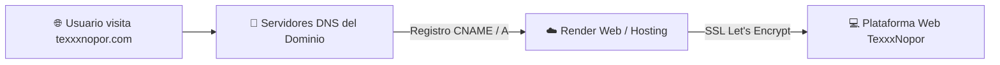
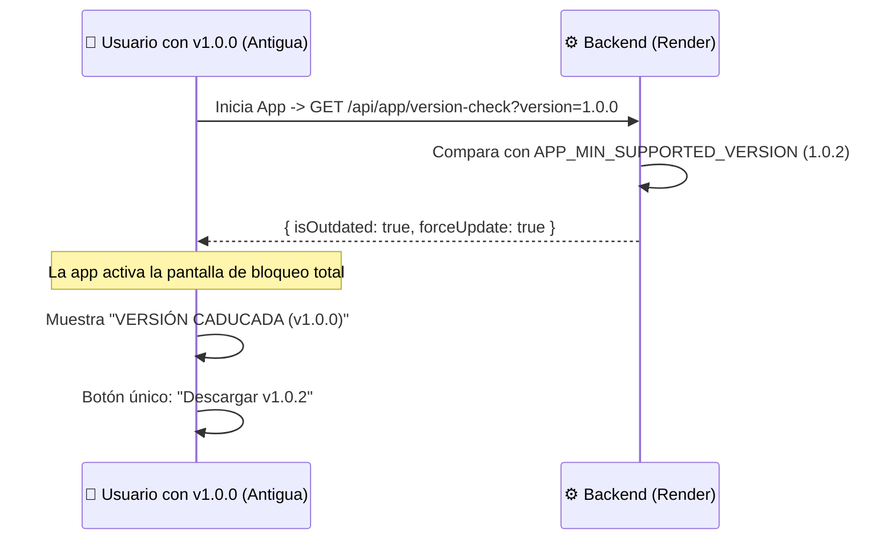

# 🚀 Manual de Despliegue, Hosting, Dominio y Generación de APK

**Plataforma de Streaming TexxxNopor**  
*Versión:* `1.0.2` | *Guía de Operaciones y DevOps*

---

## 1. Generación de la Aplicación Android (APK) con EAS Build

Para compilar el instalable `.apk` para celulares Android utilizando los servidores en la nube de Expo Application Services (EAS):

### Paso 1: Requisitos Previos
Tener instalado el CLI de EAS e iniciar sesión con tu cuenta de Expo:
```bash
npm install -g eas-cli
eas login
```

### Paso 2: Ejecutar la Compilación del APK
Desde la carpeta `mobile/` ejecuta:
```bash
cd mobile
eas build --platform android --profile preview
```

### Paso 3: Descarga e Instalación
- EAS generará un enlace de descarga en la nube y un código QR.
- Al abrir el enlace en tu celular Android, se descargará el archivo `TexxxNopor-v1.0.2.apk` listo para instalar y compartir con los usuarios.

---

## 2. Despliegue de la Plataforma Web en Render (Hosting Gratis 24/7)

La aplicación está construida sobre **React Native Web**, lo que permite compilar una versión web idéntica a la aplicación móvil.

### Opción A: Crear un "Static Site" en Render (Recomendada)
1. Inicia sesión en **[dashboard.render.com](https://dashboard.render.com)**.
2. Haz clic en el botón superior azul **"New +"** $\rightarrow$ selecciona **"Static Site"**.
3. Conecta tu repositorio de GitHub: `edimartinezpos2-beep/TexxxNopor`.
4. Configura los parámetros de compilación:

| Parámetro | Valor Exacto |
| :--- | :--- |
| **Name** | `texxxnopor-web` |
| **Branch** | `main` |
| **Root Directory** | `mobile` |
| **Build Command** | `npx expo export -p web` (o `npm run build`) |
| **Publish Directory** | `dist` |

5. En **Advanced $\rightarrow$ Add Environment Variable**, agrega:
   - `NODE_VERSION` = `20`
   - `EXPO_PUBLIC_API_URL` = `https://texxxnopor-backend.onrender.com`
   - `EXPO_PUBLIC_WOMPI_URL` = `https://checkout.wompi.co/l/VPOS_4BlRq7`
6. Haz clic en **"Create Static Site"**. En 1 minuto tu web estará disponible en línea.

---

## 3. Configuración de Dominio Personalizado (ej. `texxxnopor.com`)

Para vincular tu propio dominio comprado en cualquier registrador (*GoDaddy, Namecheap, Hostinger, DonDominio, Porkbun*):



### Pasos en el Panel de Render:
1. En tu servicio de Render (Static Site o Backend), ve a **Settings $\rightarrow$ Custom Domains**.
2. Haz clic en **"Add Custom Domain"** y escribe: `texxxnopor.com` y `www.texxxnopor.com`.
3. Render te mostrará los registros DNS requeridos:
   - **Registro A:** Host `@` $\rightarrow$ IP proporcionada por Render (ej. `216.24.57.1`)
   - **Registro CNAME:** Host `www` $\rightarrow$ `texxxnopor-web.onrender.com`

### Pasos en tu Proveedor de Dominio:
1. Entra a la administración DNS de tu dominio en GoDaddy/Namecheap/Hostinger.
2. Agrega el Registro A y el Registro CNAME indicados por Render.
3. En pocos minutos, Render emitirá automáticamente el **Certificado SSL HTTPS gratis** y tu sitio responderá de forma segura en `https://texxxnopor.com`.

---

## 4. Solución al Modo Reposo de Render (UptimeRobot 24/7 Gratis)

En el plan gratuito de Render, los servidores se suspenden tras 15 minutos de inactividad. Para mantener el backend despierto las 24 horas del día sin costo:

1. Ve a **[uptimerobot.com](https://uptimerobot.com)** y crea una cuenta gratuita.
2. Haz clic en **"Add New Monitor"**:
   - **Monitor Type:** `HTTP(s)`
   - **Friendly Name:** `TexxxNopor Backend 24/7`
   - **URL:** `https://texxxnopor-backend.onrender.com/api/auth/bootstrap-status`
   - **Monitoring Interval:** `Every 5 minutes`
3. Haz clic en **"Create Monitor"**.
4. UptimeRobot enviará una petición ligera cada 5 minutos, evitando que Render entre en reposo y garantizando respuestas instantáneas en menos de 1 segundo.

---

## 5. Sistema de Caducidad y Bloqueo de Versiones Anteriores (Force Update)

Cuando desarrolles una nueva versión (por ejemplo `v1.0.3` o `v2.0.0`) y necesites que las versiones anteriores dejen de funcionar inmediatamente:



### ¿Cómo activar el bloqueo al lanzar una nueva versión?
1. En tu panel de **Render** $\rightarrow$ `texxxnopor-backend` $\rightarrow$ **Environment**:
   - Cambia `APP_MIN_SUPPORTED_VERSION` al nuevo número (ej. `1.0.3`).
   - Cambia `APP_LATEST_VERSION` a `1.0.3`.
   - Cambia `APP_UPDATE_URL` con el link del nuevo APK compilado.
2. Guarda los cambios. A partir de ese instante:
   - Cualquier usuario que abra la versión `1.0.2` o inferior verá la pantalla de bloqueo obligatoria y no podrá utilizar la app hasta que instale la nueva versión.
