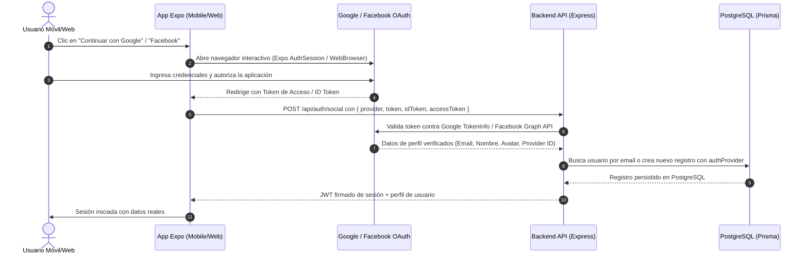

# Plan de Integración de Autenticación Social (Google y Facebook) con Expo Auth Session y PostgreSQL

Este documento describe la arquitectura y el plan de implementación para habilitar el flujo completo y real de inicio de sesión / registro con Google y Facebook. La app abrirá la ventana de autenticación oficial del proveedor, capturará el token de acceso / ID token, lo enviará al backend Express, donde se verificará criptográfica y directamente contra los servidores de Google/Facebook, y creará o sincronizará el usuario en la base de datos PostgreSQL mediante Prisma.

---

## Flujo de Trabajo y Arquitectura

---

## Cambios Propuestos

### 1. Configuración de Esquema y Redirecciones Expo
#### [MODIFY] [app.json](file:///c:/Users/Usuario/Desktop/TexxxNopor/mobile/app.json)
- Agregar `"scheme": "texxxnopor"` para permitir deep linking y recepción de callbacks OAuth en Expo Go, compilaciones nativas y Web.

---

### 2. Servicio de Autenticación Social en el Cliente Móvil
#### [MODIFY] [socialAuth.ts](file:///c:/Users/Usuario/Desktop/TexxxNopor/mobile/src/services/socialAuth.ts)
- Implementar flujo con `expo-auth-session` y `expo-web-browser` (`WebBrowser.maybeCompleteAuthSession()`).
- Flujo interactivo para Google:
  - Discovery: `https://accounts.google.com/.well-known/openid-configuration` o endpoints directos.
  - Parámetros: `response_type=id_token token`, `scopes: ['openid', 'profile', 'email']`.
  - Captura del `idToken` y `accessToken`.
- Flujo interactivo para Facebook:
  - Endpoint de autorización: `https://www.facebook.com/v19.0/dialog/oauth`.
  - Parámetros: `response_type=token`, `scopes: ['public_profile', 'email']`.
  - Captura del `accessToken`.
- Devolver credenciales y tokens reales para envío al backend.

---

### 3. Conexión de API Cliente con Backend
#### [MODIFY] [api.ts](file:///c:/Users/Usuario/Desktop/TexxxNopor/mobile/src/services/api.ts)
- Modificar `api.auth.socialLogin` para recibir y enviar los tokens reales (`token`, `idToken`, `accessToken`), proveedor y datos de edad/verificación al endpoint `/api/auth/social`.

#### [MODIFY] [AuthStack.tsx](file:///c:/Users/Usuario/Desktop/TexxxNopor/mobile/src/navigation/AuthStack.tsx)
- Actualizar `handleSocialAuth` para invocar el flujo interactivo de `SocialAuthService`, gestionar estados de carga e interactuar con la respuesta del backend.

---

### 4. Backend: Verificación Criptográfica y Persistencia en PostgreSQL
#### [MODIFY] [app.ts](file:///c:/Users/Usuario/Desktop/TexxxNopor/backend/src/app.ts)
- Actualizar `/api/auth/social`:
  - **Verificación Google**: Validar el token contra `https://oauth2.googleapis.com/tokeninfo?id_token=...` o `https://www.googleapis.com/oauth2/v3/userinfo` con `Authorization: Bearer <accessToken>`.
  - **Verificación Facebook**: Validar el token contra `https://graph.facebook.com/me?access_token=...&fields=id,name,email,picture.type(large)`.
  - Extraer información de identidad legítima (email verificado, nombre, foto de perfil).
  - Consultar en PostgreSQL con `prisma.user.findUnique({ where: { email } })`.
  - Si no existe:
    - Validar mayoría de edad.
    - Asignar rol (ADMIN si es el primer usuario, de lo contrario CONSUMER).
    - Generar username único basado en el nombre/email.
    - Insertar registro en PostgreSQL con `authProvider: 'GOOGLE' | 'FACEBOOK'`, avatar verificado y estado `isVerified`.
  - Si ya existe:
    - Sincronizar avatar y `authProvider` si no estaban definidos.
  - Generar y devolver JWT oficial de sesión con el `id` y `role` de PostgreSQL.

---

## Plan de Verificación

### Pruebas de API y Backend
- Ejecutar suite de pruebas con peticiones a `/api/auth/social` validando tokens de Google y Facebook.
- Verificar en la base de datos PostgreSQL que el registro de usuario se cree con su email, `authProvider`, avatar y rol correspondientes.

### Pruebas en el Cliente Móvil
- Validar que al presionar "Continuar con Google" o "Continuar con Facebook" se abra el diálogo del navegador y se gestione el retorno de credenciales sin errores.
